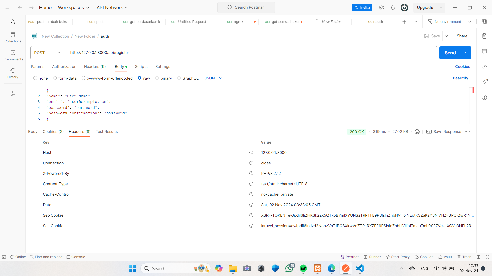
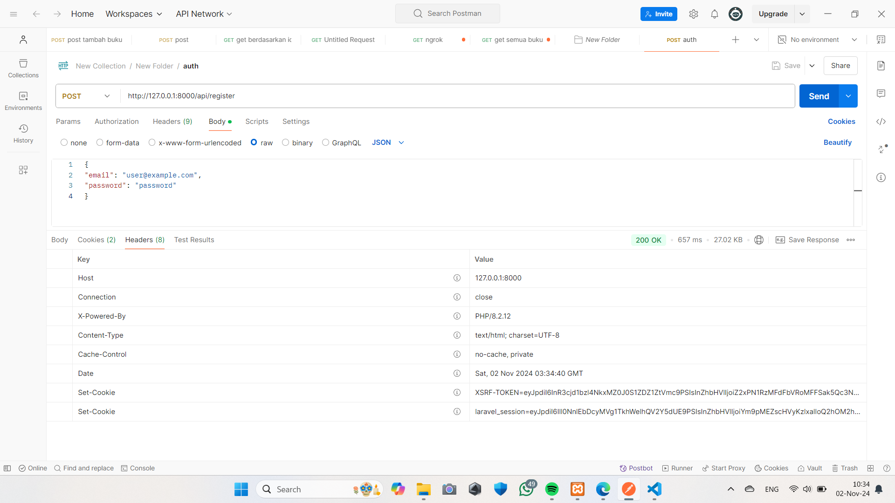
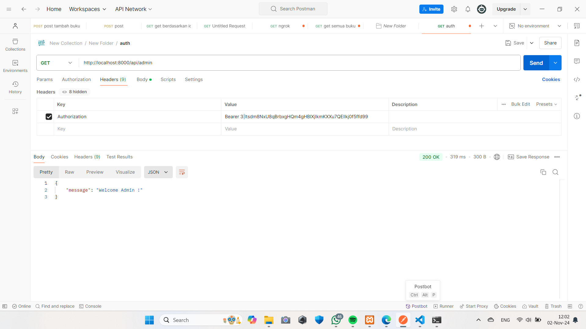
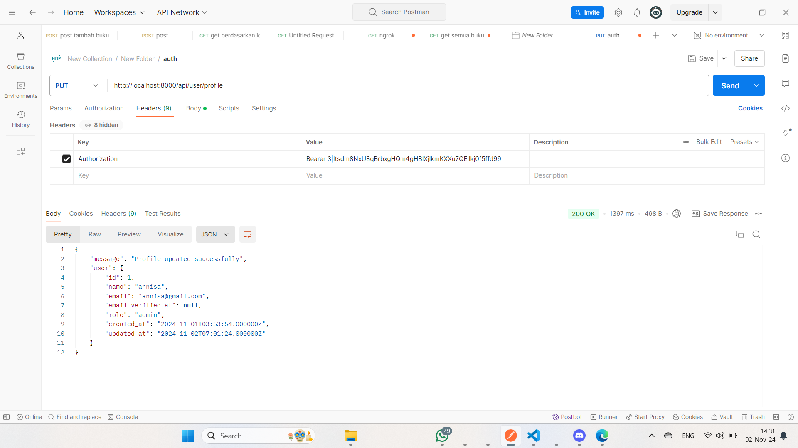
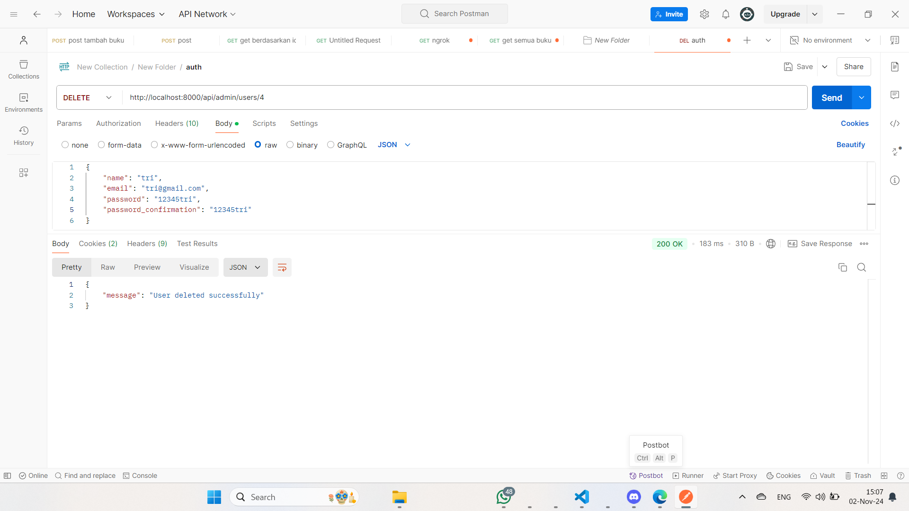
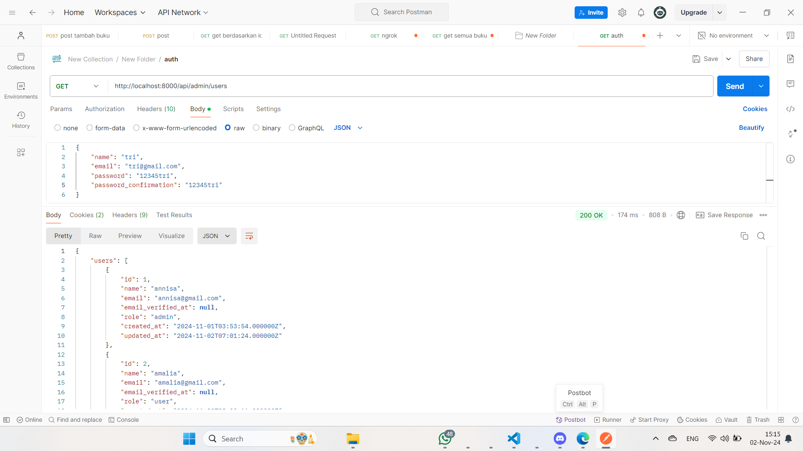

1. Apa yang dimaksud dengan Laravel Sanctum?
Jawab : Laravel Sanctum adalah paket otentikasi yang disediakan oleh Laravel untuk mengelola token API dan otentikasi berbasis cookie yang ringan. Sanctum memungkinkan aplikasi Laravel untuk mengautentikasi pengguna dalam aplikasi single-page (SPA), aplikasi mobile, dan juga untuk menyediakan otentikasi berbasis token API untuk aplikasi pihak ketiga.

2. Bagaimana cara mengelola token autentikasi di Laravel?
Jawab : 
~Instal Laravel Sanctum
~Konfigurasi Model User
~Buat Endpoint untuk Login dan Pembuatan Token
~Menggunakan Token untuk Autentikasi di API
~Membuat Middleware untuk Melindungi Endpoint
~Logout dan Menghapus Token

3. Sebutkan langkah-langkah untuk menambahkan otorisasi berbasis peran dalam API!
Jawab : 
~Menambahkan Kolom role pada Tabel users
~Tambahkan Nilai role di Model User
~Menambahkan Middleware untuk Otorisasi Berdasarkan Peran
~Daftarkan Middleware di Kernel.php
~Menambahkan Middleware role ke Route
~Menambahkan Cek Otorisasi di Controller (Opsional)
~Pengujian

REGISTER

LOGIN

ADMIN

Tambahkan fitur untuk memperbarui profil pengguna.

Implementasikan sistem untuk menghapus pengguna dengan otorisasi admin. 

Buat API untuk mengambil daftar semua pengguna (hanya bisa diakses oleh admin).

